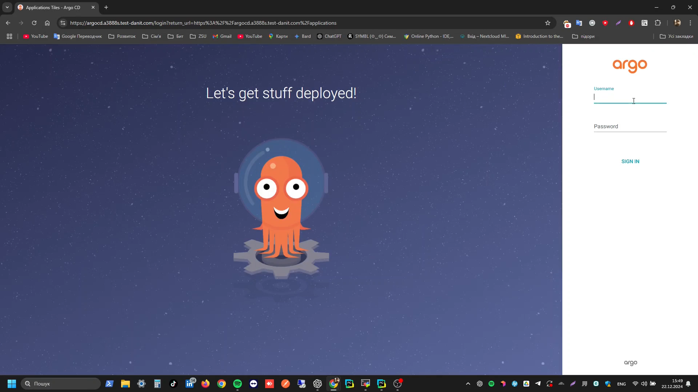

# 📘 Step Final Project: Автоматизація інфраструктури

## 📝 Загальний опис

Цей проект 🌐 призначений для автоматизації управління інфраструктурою ⚙️ та розгортання додатків 📱 у хмарному ☁️ середовищі AWS. Завдяки Terraform 🌍, Kubernetes 🐳 і ArgoCD 🚀 забезпечується ефективна робота кластерів 🖥️ EKS та їх автоматизоване обслуговування. Основна мета проекту — спрощення процесів розгортання, тестування 🧪 та управління додатками, що робить DevOps-процеси більш надійними та масштабованими.

---

## 🗂️ Структура проекту

```
├── 📘 README.md
├── 📁 app
│   ├── 🐳 Dockerfile
│   ├── 📜 app.py
│   ├── 📂 k8s
│   │   ├── 📁 dev
│   │   │   ├── 📄 deployment.yaml
│   │   │   ├── 📄 ingress.yaml
│   │   │   ├── 📄 service.yaml
│   │   │   └── 📄 step-final-app-dev.yaml
│   │   └── 📁 prod
│   │       ├── 📄 deployment.yaml
│   │       ├── 📄 ingress.yaml
│   │       ├── 📄 service.yaml
│   │       └── 📄 step-final-app-prod.yaml
│   └── 📄 requirements.txt
└── 📂 terraform
    ├── 📄 bucket.tf
    ├── 📂 eks
    │   ├── 📄 acm.tf
    │   ├── 📄 argocd.tf
    │   ├── 📄 backend.tf
    │   ├── 📄 eks-cluster.tf
    │   ├── 📄 eks-worker-nodes.tf
    │   ├── 📄 external-dns.tf
    │   ├── 📄 iam.tf
    │   ├── 📄 ingress_controller.tf
    │   ├── 📄 metrics-server.tf
    │   ├── 📄 provider.tf
    │   ├── 📄 sg.tf
    │   ├── 📄 terraform.tfvars
    │   └── 📄 variables.tf
    ├── 📄 outputs.tf
    └── 📄 variables.tf
```

- **`app/`**: Код додатку, його конфігурації та Kubernetes-маніфести.
- **`terraform/`**: Конфігурації для управління інфраструктурою ☁️ AWS.

---

## Відео демонстрація виконання

[](https://youtu.be/M9Q5dQfWt-Q?si=RGDpFitf9EVc4h8V)

## ⚙️ Налаштування AWS CLI

1. Встановіть AWS CLI.
2. Запустіть команду для налаштування облікових даних:
   ```sh
   aws configure
   ```
   - Введіть свої облікові дані 🔑 та регіон 🌍 (`eu-central-1`).

---

## 🚧 Розгортання інфраструктури

1. Ініціалізуйте Terraform 🌍:
   ```sh
   terraform init -backend-config "region=eu-central-1" -backend-config "profile=danit"
   ```
2. Запустіть конфігурації для створення ресурсів:
   ```sh
   terraform apply -var="iam_profile=danit"
   ```
   
---

## 🐳 Конфігурація Kubernetes EKS

1. Оновіть kubeconfig для доступу до кластеру 🖥️:
   ```sh
   aws eks --region eu-central-1 update-kubeconfig --name danit
   ```

---

## 🔒 Налаштування ArgoCD

1. Змініть пароль 🔑 адміністратора:
   ```sh
   kubectl -n argocd exec -it deployment/argocd-server -- argocd admin initial-password --password <new-password>
   ```
   
---

## 💻 Розгортання середовища розробки

1. Перейдіть до каталогу середовища розробки 🛠️:
   ```sh
   cd app/k8s/dev
   ```
2. Запустіть команду для розгортання:
   ```sh
   kubectl apply -f step-final-app-dev.yaml
   ```

---

## 🏭 Розгортання у продакшн середовищі

1. Перейдіть до каталогу продакшн 🏢:
   ```sh
   cd app/k8s/prod
   ```
2. Виконайте розгортання маніфестів:
   ```sh
   kubectl apply -f step-final-app-prod.yaml
   ```
3. Синхронізуйте додаток через ArgoCD 🚀:
   ```sh
   argocd app sync step-final-app-prod
   ```
4. Підтвердіть успішну синхронізацію та розгортання через ArgoCD:
   ```sh
   argocd app get step-final-app-prod
   ```
   
---

## 🌿 Управління гілками

1. Створіть нову гілку для розробки 🌱:
   ```sh
   git checkout -b dev
   ```
2. Збережіть зміни ✏️ та відправте їх у віддалений репозиторій 🌐:
   ```sh
   git add .
   git commit -m "Опис змін"
   git push origin dev
   ```
3. Після тестування об'єднайте гілки `dev` і `main` 🛠️:
   ```sh
   git checkout main
   git merge dev
   ```
   
---

## 💻 Моніторинг

Додано розгортання `kube-prometheus-stack` через Helm для моніторингу кластеру Kubernetes.

   

---

## 🏁 Висновок

Проект демонструє ефективний підхід до автоматизації DevOps 🔧. Використання Terraform 📜 для управління інфраструктурою, Kubernetes 🐳 для оркестрації контейнерів та CI/CD ⚙️ забезпечує швидкість ⏩, надійність 🛡️ і масштабованість 📈 для сучасних розробників 👨‍💻.

